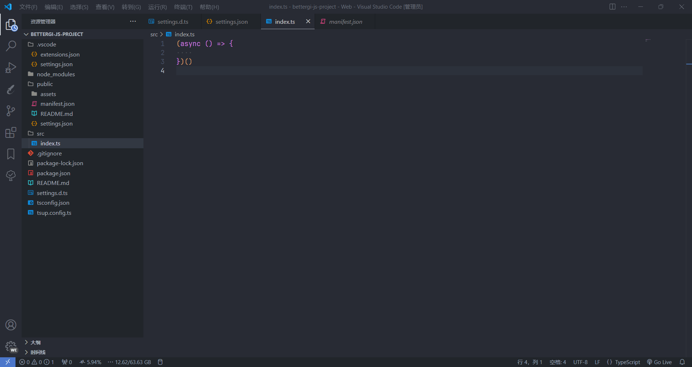
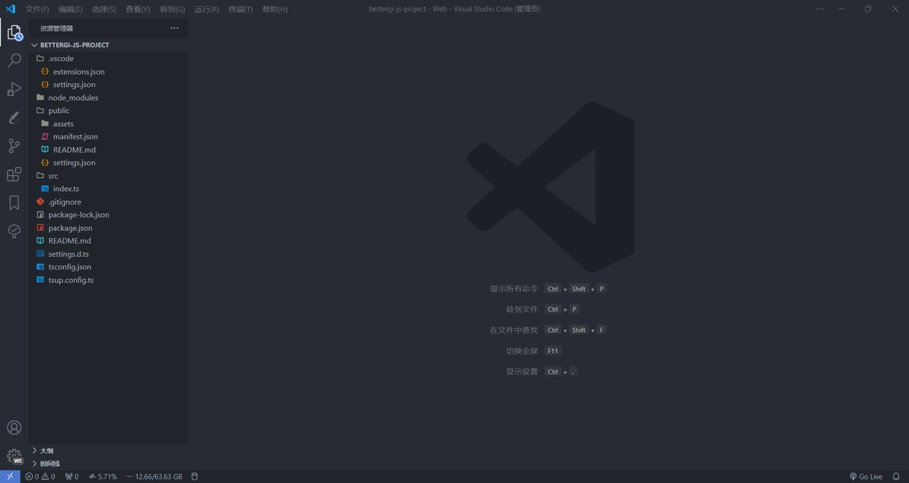
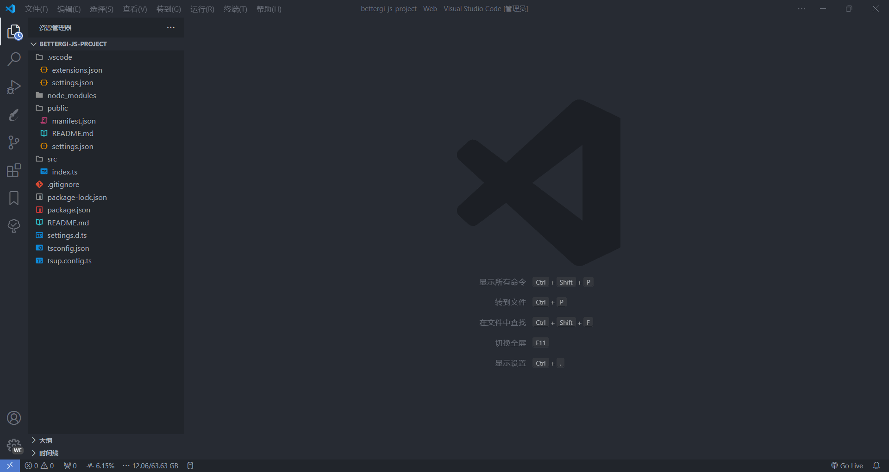
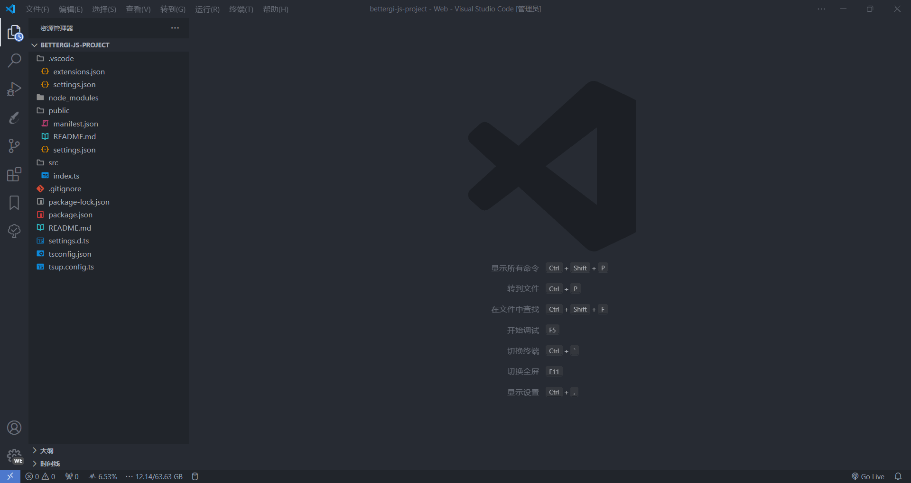

# BetterGI JS

BetterGI JS 脚本辅助库，可以帮助你快速构建和调试 BetterGI JS 脚本。

## 🌟 特性

- 基于 TypeScript，提供 BetterGI JS 脚本开发所需的类型定义。
- 基于 tsup 支持动态打包，搭配 BetterGI 即可实时调试脚本。
- 支持 `manifest.json` 和 `settings.json` 配置文件 schema 验证。

## ⚙️ 使用

```bash
npm create bettergi-js
```

## 📹 演示

类型推断



<details>
  <summary>点击展开/收起更多演示</summary><br>

配置变量



打包构建



动态打包



</details>

## 📖 示例

+ [PrintTime](./examples/print-time/README.md) - 打印当前时间。
